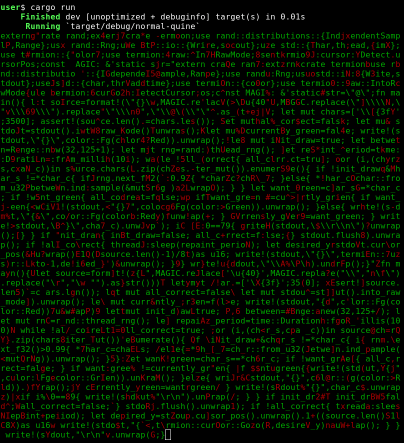

# normal-quine

> A quine that "decodes" itself.

Just a cute quine that appears to "decode" itself. Here's a rough preview:

## Table of Contents

- [Usage](#usage)
- [NOTDOs](#notdos)
- [Contribute](#contribute)

## Usage

Just use it!

`cargo run`

## NOTDOs

Everything. This is an old, dead project.

## Contribute

Feel free to dive in! [Open an issue](https://github.com/BenWiederhake/normal-quine/issues/new) or submit PRs.
